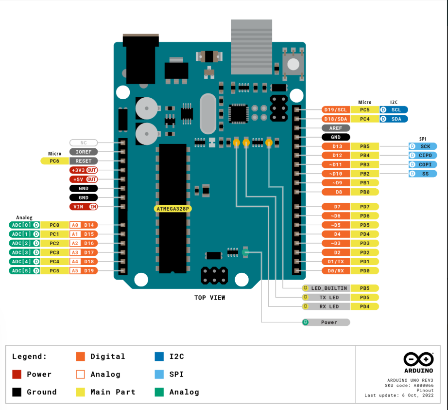
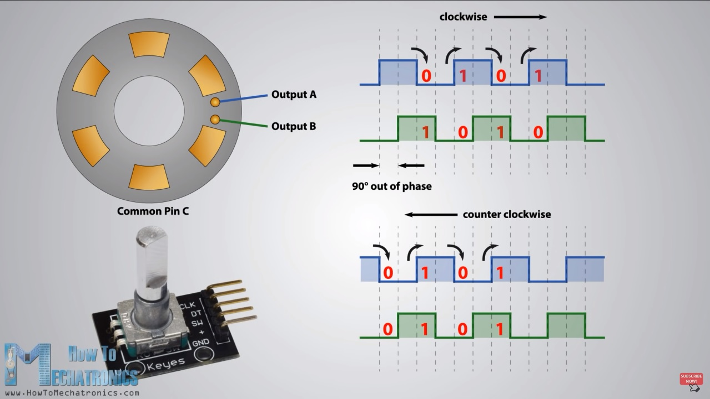
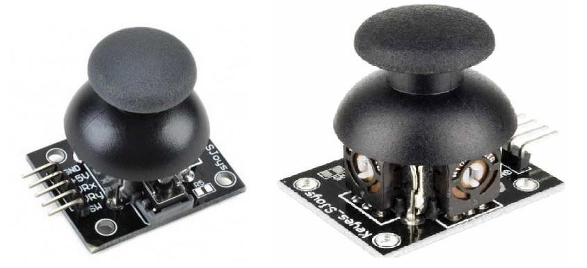
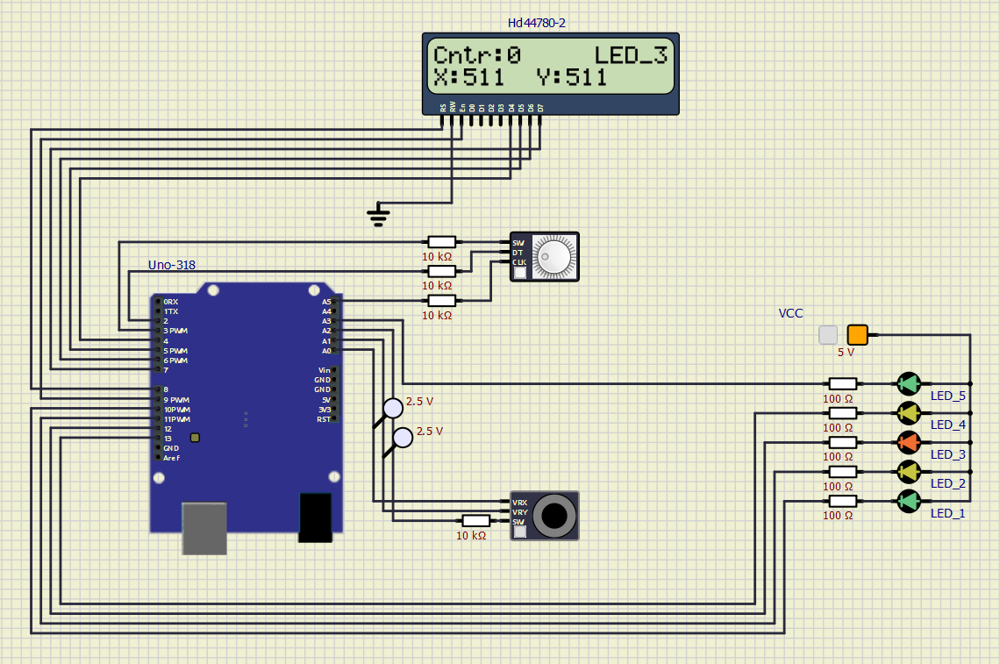
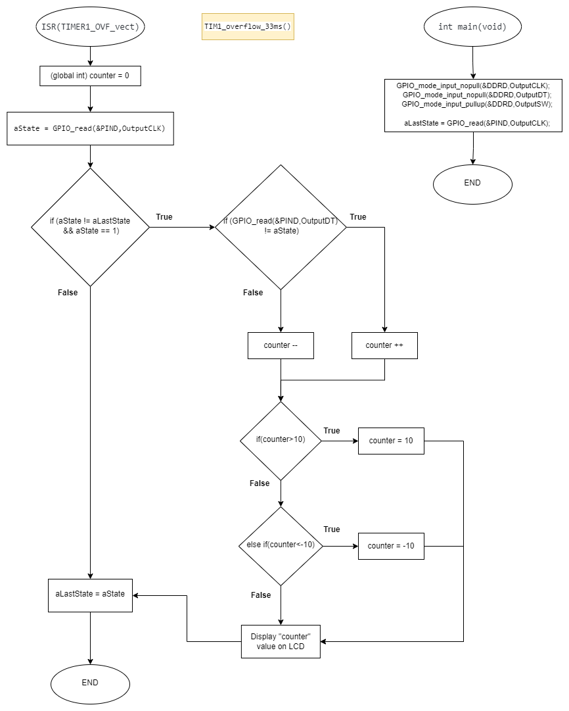
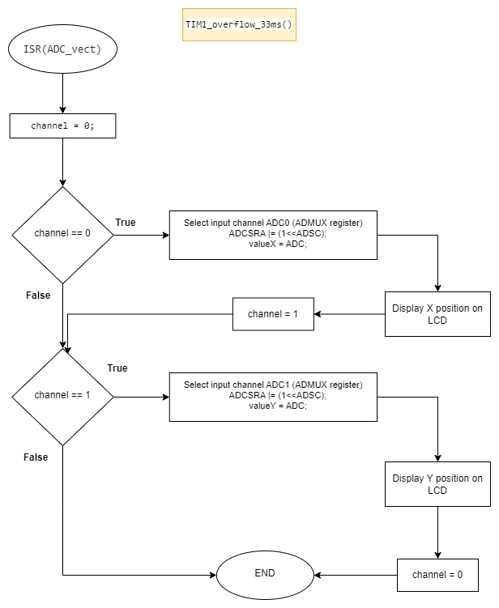
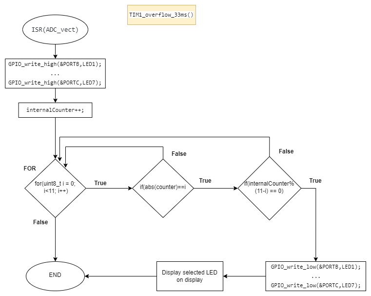

# Project 1 - Analog joy-stick, rotary encoder, LCD and LEDs.

Application of analog joy-stick (2 ADC channels, 1 push button), rotary encoder, and Digilent PmodCLP LCD module.


## Team members

   * Josef Komár 230271 (Responsible for: encoder program, control of LEDs and their flashing, video)
   * Ondřej Sedlák 230312 (Responsible for: joystick program, overall program completion and debugging, github documentation)

## Hardware description

In our project we use the Arduino UNO board, which is based on the ATMEGA328P AVR chip. External components are also used, such as an analog joystick, a rotary encoder, an agilent LCD display and 7 different colored LEDs.



### Rotary encoder

A rotary encoder is a type of position sensor which is used for determining the angular position of a rotating shaft. It generates an electrical signal, either analog or digital, according to the rotational movement.



### Analog joy-stick

Analog joystick produces two voltages; one corresponding to position with respect to X-axis and another corresponding to the position with respect to Y-axis. The voltages produced depend on the position of the joystick.
To interface the Analog Joystick with Arduino Uno, we need to use ADC on the microcontroller of the Arduino UNO board.



### SimulIDE simulation



## Software description

In the code we used several libraries created in school computer exercises, e.g. timer, gpio and lcd.

Put flowchats of your algorithm(s). Write descriptive text of your libraries and source files. Put direct links to these files in `src` or `lib` folders.

### Source files & libraries

 1. **Timer:** [timer.h](https://github.com/xsedla1y/digital-electronics-2/blob/main/Project1/include/timer.h)
 2. **Gpio:** [gpio.c](https://github.com/xsedla1y/digital-electronics-2/blob/main/Project1/lib/gpio/gpio.c), [gpio.h](https://github.com/xsedla1y/digital-electronics-2/blob/main/Project1/lib/gpio/gpio.h)
 3. **LCD:** [lcd.c](https://github.com/xsedla1y/digital-electronics-2/blob/main/Project1/lib/lcd/lcd.c), [lcd.h](https://github.com/xsedla1y/digital-electronics-2/blob/main/Project1/lib/lcd/lcd.h), [lcd_definitions.h](https://github.com/xsedla1y/digital-electronics-2/blob/main/Project1/lib/lcd/lcd_definitions.h)
 4. **Source:** [main.c](https://github.com/xsedla1y/digital-electronics-2/blob/main/Project1/src/main.c)

  The final project structure looks like this:
   ```c
   ├── include
   │   └── timer.h
   ├── lib
   │   └── gpio
   │       ├── gpio.c
   │       └── gpio.h
   |   └── lcd
   │       ├── lcd.c
   │       ├── lcd.h
   │       └── lcd_definitions.h
   └── src
       └── main.c
   ```

### Software flowcharts

#### Encoder algorithm


#### Joystick algorithm


#### LEDs algorithm


## Video

Insert a link to a short video with your practical implementation example (1-3 minutes, e.g. on YouTube).

## References

1. [Rotary encoder in Arduino](https://howtomechatronics.com/tutorials/arduino/rotary-encoder-works-use-arduino/)
2. [Arduino Uno pinout](https://docs.arduino.cc/hardware/uno-rev3)
3. [Arduino Uno datasheet](https://docs.arduino.cc/static/581ef7a3be69646a3f9eb4f6e2575548/A000066-datasheet.pdf)
4. [Joystick in Arduino](https://www.electronicwings.com/arduino/analog-joystick-interfacing-with-arduino-uno)
