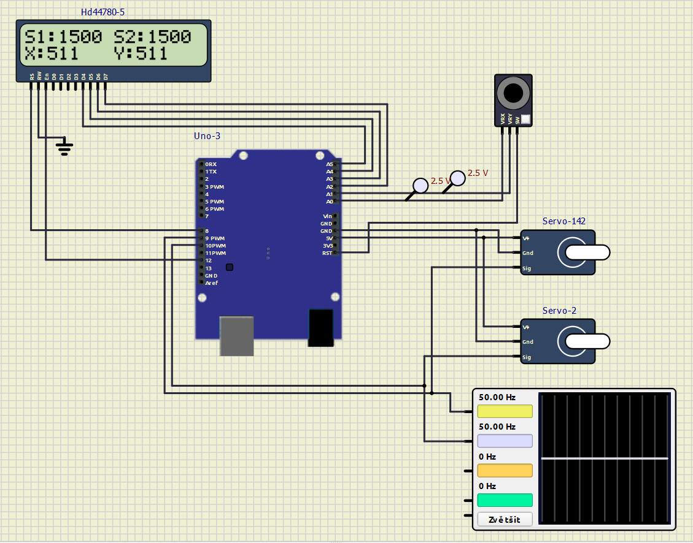

# Project 2 - Analog joy-stick, 2 servo motors and LCD display

Application of analog joy-stick (2 ADC channels, 1 push button), 2 SG90 Micro Servos and Digilent PmodCLP LCD module.

## Team members

   * Josef Komár 230271 (Responsible for: encoder program, control of LEDs and their flashing, video, flowcharts)
   * Ondřej Sedlák 230312 (Responsible for: joystick program, overall program completion and debugging, github documentation, SimulIDE)

## Hardware description

In our project we use the Arduino UNO board, which is based on the ATMEGA328P AVR chip. We're using some external components: joystick and two SG90 servos. Joystick is connected into the analog terminal and operates these servos via A/D conversion - it switches output terminals and changes the duty cycle of the PWM signals.


### LCD display

In labs we are using this type of LCD display. Documentations can be found in references.


### Analog joy-stick

Analog joystick produces two voltages; one corresponding to position with respect to X-axis and another corresponding to the position with respect to Y-axis. The voltages produced depend on the position of the joystick.
To interface the Analog Joystick with Arduino Uno, we need to use ADC on the microcontroller of the Arduino UNO board.


### SG90 Micro Servo


## SimulIDE simulation

Simulation can be done in SimulIDE V.1.0.0
For simulation purposes the timer needs to be changed. We've already created "hex" file, that You can upload to Arduino Uno board in SimulIDE.

**Firmware:** [firmware.hex](https://github.com/xsedla1y/digital-electronics-2/blob/main/Project2/Project2_simulations/firmware.rar) <br/>
**SimulIDE template:** [project2.sim1](https://github.com/xsedla1y/digital-electronics-2/blob/main/Project2/Project2_simulations/project2.sim1)



## Software description

In the code we used several libraries created in school computer exercises, e.g. timer, gpio and lcd.

### Source files & libraries

 1. **Timer:** [timer.h](https://github.com/xsedla1y/digital-electronics-2/blob/main/Project2/include/timer.h)
 2. **Gpio:** [gpio.c](https://github.com/xsedla1y/digital-electronics-2/blob/main/Project2/lib/gpio/gpio.c), [gpio.h](https://github.com/xsedla1y/digital-electronics-2/blob/main/Project2/lib/gpio/gpio.h)
 3. **LCD:** [lcd.c](https://github.com/xsedla1y/digital-electronics-2/blob/main/Project2/lib/lcd/lcd.c), [lcd.h](https://github.com/xsedla1y/digital-electronics-2/blob/main/Project2/lib/lcd/lcd.h), [**lcd_definitions.h (modified)**](https://github.com/xsedla1y/digital-electronics-2/blob/main/Project2/lib/lcd/lcd_definitions.h)
 4. **Source:** [main.c](https://github.com/xsedla1y/digital-electronics-2/blob/main/Project2/src/main.c)

  The final project structure looks like this:
   ```c
   ├── include
   │   └── timer.h
   ├── lib
   │   └── gpio
   │       ├── gpio.c
   │       └── gpio.h
   |   └── lcd
   │       ├── lcd.c
   │       ├── lcd.h
   │       └── lcd_definitions.h //(modified LCD connections)
   └── src
       └── main.c
   ```

### Software flowcharts

#### Timer0 algorithm


#### Joystick and 2 servos algorithm


## Video

[Link to a short video of our practical implementation of Project2]()

## References

1. [SG90 Micro Servo](https://www.kjell.com/globalassets/mediaassets/701916_87897_datasheet_en.pdf?ref=4287817A7A)
2. [Arduino Uno pinout](https://docs.arduino.cc/hardware/uno-rev3)
3. [Arduino Uno datasheet](https://docs.arduino.cc/static/581ef7a3be69646a3f9eb4f6e2575548/A000066-datasheet.pdf)
4. [Joystick in Arduino](https://www.electronicwings.com/arduino/analog-joystick-interfacing-with-arduino-uno)
5. [LCD display](https://www.tme.eu/en/details/410-142p/add-on-boards/digilent/pmodclp/)
